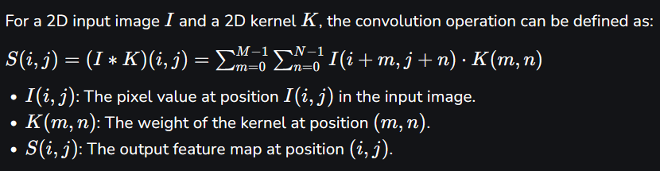
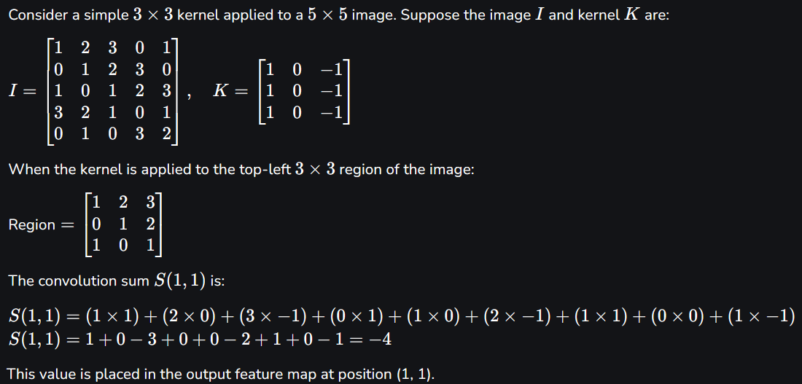
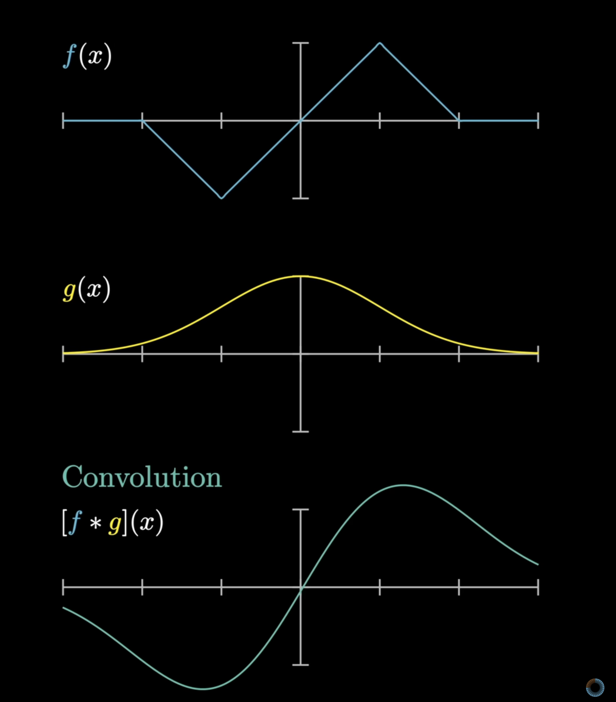
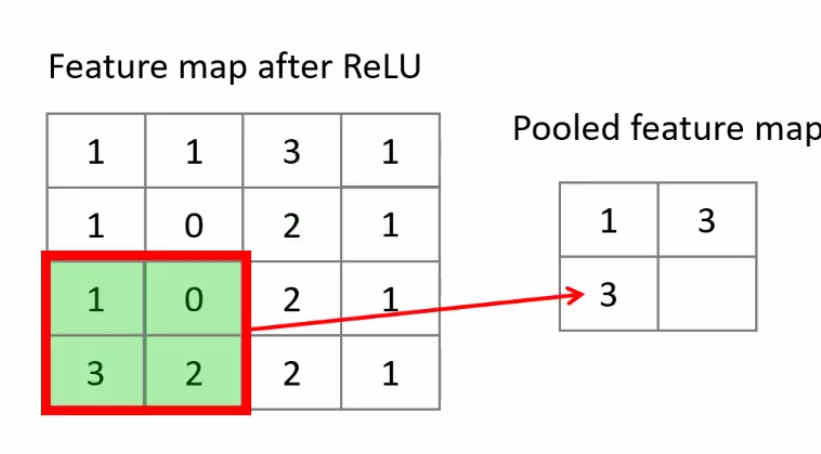
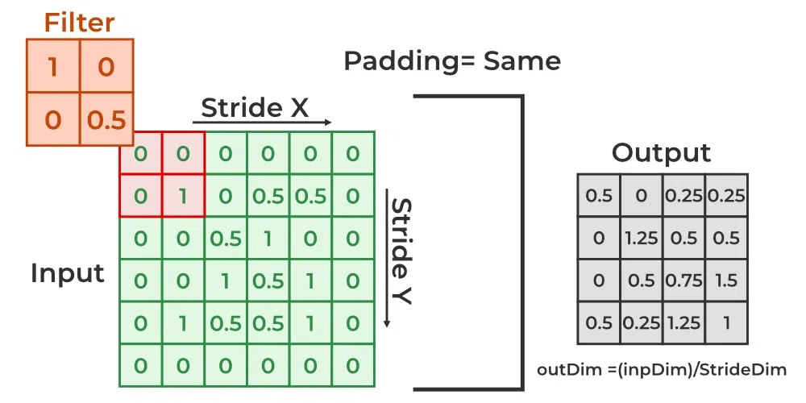
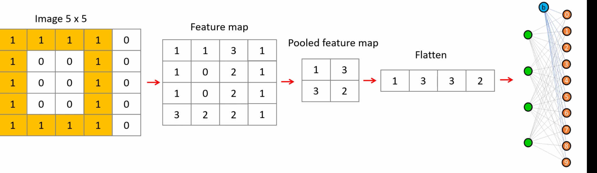

### Convolutional Neural Networks
> Terminology 

- **Convolution** = procedure when you slide **kernel** on image to extract it's characteristic features (resulting matrix is called **feature map**), to get feature map values you multiply overlapping values at each position 

    
    
<!--  -->
- **Stride** = the number of pixels by which we move the filter across the input image (right and down)
    

- **Pooling** = technique to **reduce** spatial dimensions **(width and height)** of feature map, it works by sliding a two-dimensional (2x2 window) filter over each channel of a feature map and **summarizing** the features within the region covered by the filter 
    > Simply: taking the **maximum** value of the four numbers in the window

    

- **Padding** = adding several rows or columns to the image (usually values there are set to 0), it is used to prevent feature map being too small during feature extraction (it becomes smaller after every kernel sliding), 
    - it's used to prevent data loss at edges, 
    - setting padding to true will make feature map the same size as original image (?)

    
---
- **Summary**:
    
