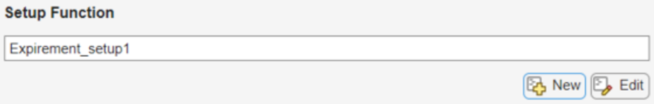
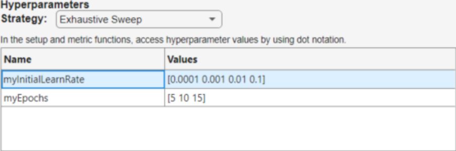
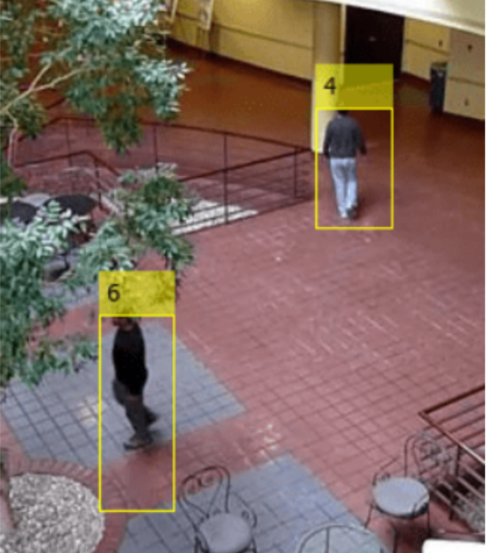

#### Functions for preparing data 

1. Datastore = variable for storing multiple images
```matlab
imgs_datastore = imageDatastore(path_to_images, "IncludeSubfolders", true, 
"LabelSource", "foldernames") % use folder names as labels of classes
```

2. Displaying images from a datastore
```matlab
montage(imgs_datastore)
```

3. Imread(), imshow() - reading a single image file as variable and displaying it
```matlab
img = imread("example.jpg")
imshow(img)
% Using empty brackets as the second input will scale the display 
% based on the minimum and maximum values present in the image.
% imshow(im,[])
```

4. Extract image's first channel (make img gray)
```matlab
image(:,:,n) % n - channel value, 1 2 3
```
4. Using kernel with image (kernel as a matrix)
```matlab
filtered_image = conv2(kernel, image)
% ex kernel = [ 0 1 0, 1 -4 1, 0 1 0] - blur
imshow(filtered_image, [])
% for RGB image (all channels present)
filtered_image = imfilter(image, kernel)
```


3. Spliting data into train / test:
```matlab 
[train_df, test_ds] = splitEachLabel(imgs_datastore, proportion) % ex. 0.7 will 
% give 70/30 split
```
4. Data augmentation:
```matlab
augmented_ds = augmentedImageDatastore([size size], ds, augmentation_type)
```
5. Adjust learning options
```matlab
options = trainingOptions("algorithm_name", "InitialLearnRate", learn_value)
% ex. "adam" 0.0001
```

6. Return the number of non zero matrix elements (usefull when calculating accuracy)
```matlab
N = nnz(matrix)
% for accuracy
accuracy = nnz(test_data.Labels == predicted_labels) / length_of_data
```
7. Confusion matrix
```matlab
confusionchart(known_labels, predicted_labels)
```

5. Predicting values:
```matlab
minibatchpredict
```

Conv layer extract certain patterns (features), usually each conv layer in a bigger network has a different filter for detecting different things like ex. hertical edges, horizontal edges, whites etc

---

#### Training a network from 'scratch' (by matlab standards)
[ Setup for Experiment manager .mat (Setup Function) ] 
- In Expirement Manager:

^generates a script to define training data, layers and training options
- Adjusting hyperparameters:

And call them in setup by:
    ```matlab
    params.myInitialLearnRate
    params.myEpochs
    ```
---
1. Function that loads defined params into training (it generated automatically)
```matlab
function [xTrain,yTrain,layers,options] =
Expirement_setup1(params) % has all parameters from below
% to load into experiment manager ? i think ?
```
2. Loading training data (expecting its already divided into train/test):
```matlab
data = load("file_name.mat");
yTrain = data.yTrain;
yTest = data.yTest;
% numer - num of array elements (len())
xTrain = reshape(data.xTrain, 28,28,1, numel(yTrain));
% reshaping so it matches network input layer
xTest = reshape(data.xTest, 28,28,1, numel(yTest));
% for images = imresize()
```
[Train\test\val for labeled data]
```matlab
idx = splitlabels(labels,[0.9,0.05]) % train test val split
```
3. Defining network architecture
```matlab
layers = [
imageInputLayer([28 28 1])
convolution2dLayer(3,8,"Padding","same")
batchNormalizationLayer
reluLayer
% etc
]
```
4. Specyfying training options
```matlab
options = trainingOptions("adam", ...
"InitialLearnRate",params.myInitialLearnRate,...
"MaxEpochs",params.myEpochs, ...
"ValidationData",{xTest yTest}, ...
"ValidationFrequency",200,...
"Shuffle","every-epoch",...
"Verbose",false);
end
```
---
- Inserting object box annotation (images detecting)
    ```matlab
    img_with_box = insertObjectAnnotation(image,...
    "rectangle",box_coordinates,label)
    % create a datastore of box labels
    ds_of_boxes = boxLabelDatastore(table)
    ```
    
    (labels are 4 and 6)

- Using function as a parameter to another function
    ```matlab
    @function % use function in a function as a parameter
    ```
- Signal data
    ```matlab
    sigds = signalDatastore("file_path", "IncludeSubfolders",true, ...
    "SignalVariableNames", varnames, ...
    "ReadOutputOrientation", "row") % datastore storing signal data
    labels = folders2labels("folder_name"); % categorical vector
    summary(labels); % get how many examples of each label there are
    % ??
    lbls = renamecats(lbls,["class1" "class2"])
    ```