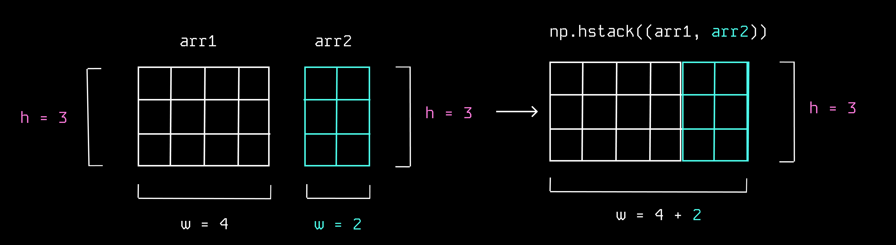
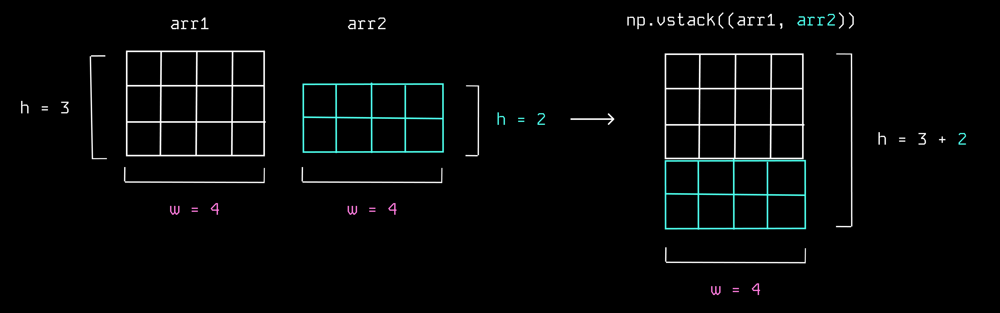

1. np.**hstack**(*sequence_of_ndarrays, dtype=None, casting='same_kind'*)
      - horizontally add two arrays to eachother

      In:
      ```python
      np.array([[1],[2],[3]]) 
      b = np.array([[4],[5],[6]])
      np.hstack((a,b)) 
      ```

      Out:
      ```python
      array([[1, 4],
            [2, 5],
            [3, 6]]) 
      ```
      
<br>

2. np.**vstack**(*sequence_of_ndarrays, dtype=None, casting='same_kind'*)
      - vertically add two arrays to eachother

      In:
      ```python
      a = np.array([1, 2, 3])
      b = np.array([4, 5, 6])
      np.vstack((a,b))
      ```
      Out:
      ```python
      array([[1, 2, 3],
            [4, 5, 6]])
      ```
      
