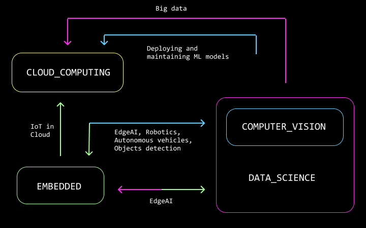

    
  </a>
  
  <h3 align="center">Ultimate learning repo</h3>
  

    Basically a placeholder for my notes on compsci / tech topics that interest me and I want to pursue with resources to tutorials, courses, lectures etc to keep track on them:)
  

   <ul>
  <li>Each topic folder contains a Resources markdown file with all useful links on covered topics </li>
  <li>All images are created by me in Figma (imgs folder)</li>
  <li>its mostly ponglish :p</li>
</ul> 

---
<h3 align="center">Interests overlap chart</h3>

    
  </a>

---
### Todo
- [x] link names and division for topics in resources
- [x] KMP algo
- [ ] upload files from previous years
