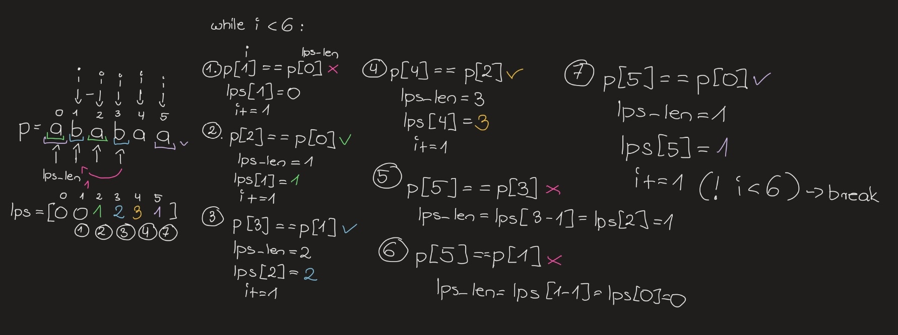

# LAB 2 
---
#### KMP algorithm
Explanation and examples:


Calculating LPS array:
```python
def computeLPSArray(pattern):
    n = len(pattern)
    lps = [0] * n # placeholder for LPS array, filled with zeroes at the start

    lps_len = 0 # length of the previous longest prefix suffix
    i = 1 
    # lps[0] is always 0 because even if the pattern matches its
    # still the 'inicialization' of the pattern, not first occurence, so i doesnt count
    while i < n:
        if pattern[i] == pattern[lps_len]: # both move through pattern, 
                                           # but lps_len is starting from 0
            lps_len += 1 
            lps[i] = lps_len # store length in lps array
            i += 1
        else:
            if lps_len != 0:
                # fall back in the pattern
                lps_len = lps[lps_len - 1]
            else:
                lps[i] = 0 # when no pattern matches in this place
                i += 1

    return lps

if __name__ == "__main__":
    # from lecture, im dyslexic no way im doing all of them by hand
    examples = ["abbbbc", "abbbba", "niekoniecznie", "kajak", "abrakadabra",
                "onions", "ananas", "banan", "matematyka", "abababababb",
                "01010101011", "CCCCTCCAG", "wydrze wydrz1 wydrze wydrze wydrze wydrz1"]
    
    for i, ex in enumerate(examples):
        print(f"Example {i+1} - {computeLPSArray(ex)}")
```
out:
```python
Example 1 - [0, 0, 0, 0, 0, 0]
Example 2 - [0, 0, 0, 0, 0, 1]
Example 3 - [0, 0, 0, 0, 0, 1, 2, 3, 0, 0, 1, 2, 3]
Example 4 - [0, 0, 0, 0, 1]
# etc
```
Example step by step:



KMP algorithm:
```python
def search(text, pattern):
    ps = computeLPSArray(pattern)
    i = 0
    j = 0

    while i < n:
        if text[i] == pattern[j]:
            i += 1
            j += 1
        else:
            if j != 0:
                j = ps[j - 1]
            else:
                i += 1
        if j == m:
            print(i - j)
            j = ps[j - 1]
```
