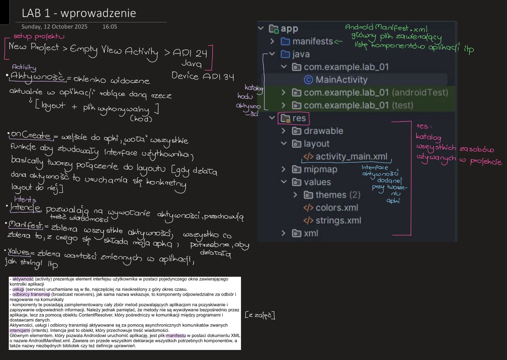
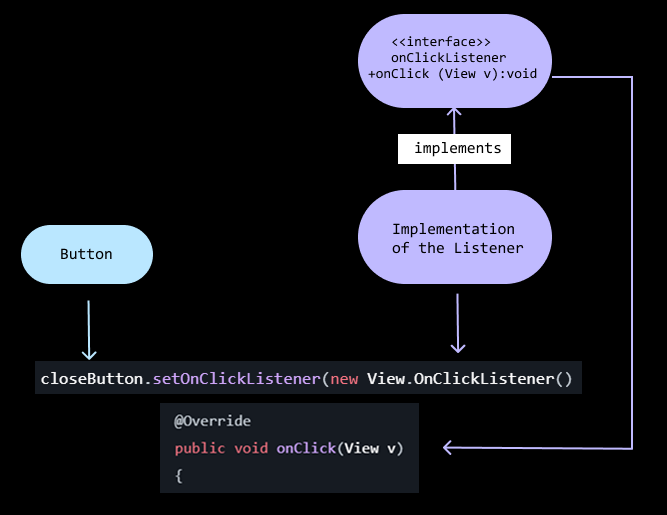
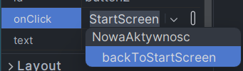

# LAB 1
---

### 0. Basic concepts, explanation of app structure

- **View** = the basic building block for creating UI components, ex. editText, Button, Switch etc

- **Ctrl + 1 / Alt + Enter** <- opens hint dialog, super useful !!
---
### 1. Basic functions
- **setContentView(R.layout.xml_file_name)** 
     >sets the XML file you want as your main layout when the app starts
    ```java
    setContentView(R.layout.activity_main) // R - res folder
    ```
- **findViewByID()** 
    > finds the first descendant view with the given ID
    ```java
    EditText editText = (EditText)findViewById(R.id.editText1); 
    // finds editText1 on layout so I can use it in my app 
    ```
    Example with a button that closes the app
    ```java
     Button closeButton = (Button) findViewById(R.id.buttonClose);
        closeButton.setOnClickListener(new View.OnClickListener() {
            @Override
            public void onClick(View v)
            {
                finish(); // stops activity
                System.exit(0); // exits app
            } });
    ```
- **View.OnClickListener()**
    > it's a part of the observer design pattern that **detects** any events related to the **UI**; for example, clicking or tapping a part of the screen executes a certain **action**
    

- Intent syntax for passing user message to other activity
    MainActivity that sends the message
    ```java
     // Get user input
    String message = messageEditText.getText().toString();
    // Create intent to navigate to MainActivity2
    Intent intent = new Intent(MainActivity.this, MainActivity2.class);
    // Pass data with intent
    intent.putExtra("message", message);
    // Start the new activity
    startActivity(intent);
    finish();
    ```
    Then in MainActivity2 to receive the message:
    ```java
    // Get message from Intent
    String message = getIntent().getStringExtra("message");
    ```
    Displaying the message:
    ```java
    // find textView that you want to display message on by its id 
    TextView textView = findViewById(R.id.textView);
    textView.setText(message);
    ```
- Calling a function when clicking a button:
    ```java
    public void backToStartScreen(View v)
    { // does something 
    }
    ```
     <- set in button attributes
<br>

# LAB 2
---
- **Handling multiple buttons with different functions** (without onClick)
    1. Make your activity implement **View.OnClickListener()**
    ```java
    public class MainActivity extends AppCompatActivity implements View.OnClickListener
    ```
    2. Implement **OnClickListener()** for all buttons:
    ```java
    //@Override
    //protected void onCreate(Bundle savedInstanceState) {
    //    super.onCreate(savedInstanceState);
    //    setContentView(R.layout.your_layout);
        
        Button one = (Button) findViewById(R.id.oneButton);
        one.setOnClickListener(this); // calling onClick() method
        Button two = (Button) findViewById(R.id.twoButton);
        two.setOnClickListener(this);
        Button three = (Button) findViewById(R.id.threeButton);
        three.setOnClickListener(this);
    //}
    ```
    3. Implement your code by finding button's ids
    ```java
    public void onClick(View v) {
        int id = v.getId(); // get clicked button's id
        if (id == R.id.oneButton) {
            // do sth
        } else if (id == R.id.twoButton) {
            // do sth
        } else if (id == R.id.threeButton) {
            // do sth
        }
    }
    ```

# LAB 3
---
- Intencje =  żąda akcji od innego składnika aplikacji, np otwarce google maps
działanie do wykonania (ACTION_VIEW, ACTION_EDIT, ACTION_MAIN)
